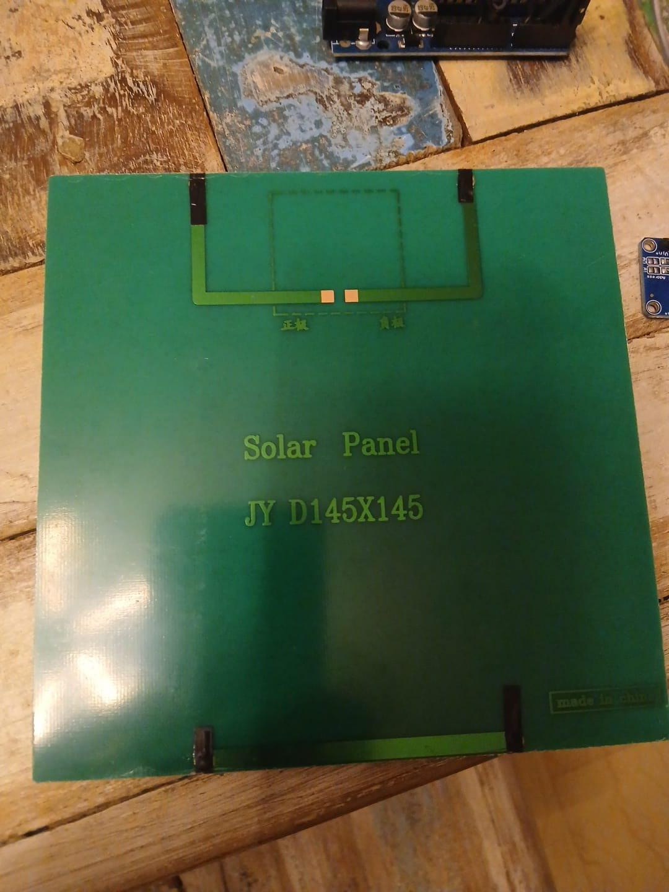

# PhotonVHealth - Solar Panel Efficiency Monitoring

Welcome to PhotonVHealth for solar panel efficiency monitoring, especially useful for DIY project users. My monitor makes sure external factors such as: 

* Dust Accumulation

* Sudden shading

* Overheating

don't cause sudden losses in the efficiency of the panel(s) while going unnoticed.

---

## Components Used:

* **LM35:** for temperature

* **KY-018 LDR:** for light

* **INA219:** for power, current & voltage produced

* **HC-06:** for bluetooth connection (to be replaced with ESP32 insha'Alah)

* **Arduino UNO:** the brain basically (to be replaced with ESP32 insha'Allah)

* **A 12V 3 Watt Panel:** for testing  

* **Soldering iron + flux:** for soldering the wires to the panel & enclosure work

* **Jumper wires, resistors and breadboard of course**

---

## LICENSING

This project is licensed under the GNU GPL v3 license, check the **[license file](LICENSE)** for details.

## Author:
**Saif Kayyali**